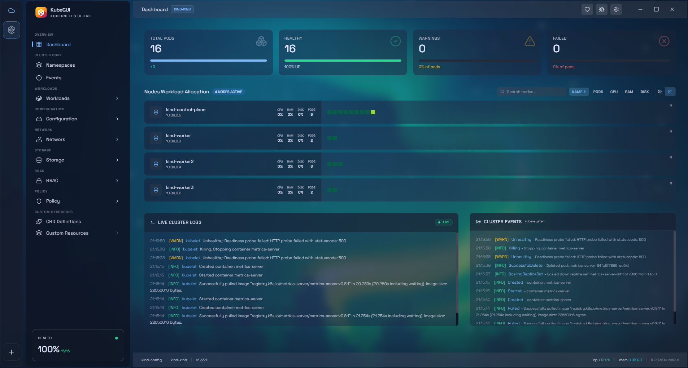

# KubeGUI - Kubernetes UI / admin desktop application
Official website - https://kubegui.net  

[](https://app.fossa.com/projects/git%2Bgithub.com%2Fgerbil%2Fkubegui?ref=badge_shield&issueType=license) [](https://app.fossa.com/projects/git%2Bgithub.com%2Fgerbil%2Fkubegui?ref=badge_shield&issueType=security) [](https://github.com/gerbil/kubegui/actions/workflows/release.yml) [](https://scorecard.dev/viewer/?uri=github.com/gerbil/kubegui)

  

# Features
> - Browse and manage Kubernetes resources with intuitive controls  
> - See changes as they happen with live updates  
> - Full support for Custom Resource Definitions (CRDs) + example generator 
> - Work seamlessly across multiple clusters
> - Powerful built-in resource editor with YAML validation and syntax highlighting  
> - No external dependencies — no kubectl required  
> - View Deployments, DaemonSets and single Pod logs with context aware highlighting  
> - Open a shell directly into your workloads (even to Nodes via admin daemonset) 
> - Automatic application updates, no manual installs  
> - Portforwarding support  

# TODO:
- Add network policies react-flow view
- Add whoami/auth check view
- Adjust ns quota modal details view
- Create roles/bindings react-flow view
- Settings view
- AI suggestions for issues/errors/warnings/etc
- Pod debugging options similar to kubectl debug  

## Scope:
1. Application code
2. Application releases
3. Website src
4. Issues/Bugs/Discussions hub

# DEV
## Rebuild all & run app in dev mode
wails3 task dev:all
## Rebuild react frontend app only
wails3 task install:frontend:deps
# Regenerate backend wails service bindings
wails3 task generate:bindings
## Run dev frontend (vite+react)
wails3 task dev:frontend
## Run dev wails app (backend)
wails3 task dev:backend

# Architecture (backend)
- Wails application serves as GUI and backend RPC server
- Backend logic organized into services with wails bindings
- Services can call each other and share internal logic
- Services expose methods to frontend via wails bindings
- Frontend calls backend methods via wails bridge
- Backend can also emit events to frontend for real-time updates

## Wails bridge
`internal/` - real backend implementations, not exposed to the frontend  
`services/` - backend implementations exposed to the frontend, with wails bindings
! services are thin bridge for real internal functions for the frontend  

## Informers design
- Informers run in the backend, watching Kubernetes resources
- Informers emit events to the frontend via wails bridge
- Frontend updates UI based on informer events
- Each informer is responsible for a specific resource type (e.g., Pods, Deployments)
- All informers should run in the background and keep the frontend updated with the latest cluster state
- All informers should have sync state (health) endpoint that the frontend can call to verify they are running properly
- All informers should have list endpoint that the frontend can call to get the current state of resources when needed (e.g., on page load)
- Nodes informer should start first, as it is required for dashboard view
- Informers should send only table (ui th) fields data as events.
- Informers should have a small buffer loop to batch events and avoid overwhelming the frontend with too many updates in busy clusters.
- Informers should handle errors gracefully and emit error events to the frontend if they encounter issues (e.g., lost connection to Kubernetes API).
- Informers should have enpoints (exposed via wails bindings) for details/list of recent resource related events and logs. The frontend can call these endpoints when user clicks on a resource to show the details/events/logs view.

## Current resource inventory
Standard resources (required informer list from `internal/resources/kube/resources.go`)

# Architecture (frontend)
- React + TypeScript + Vite frontend
- Mantine UI components for layout and styling
- React Router for client-side routing
- Tenstack query for data fetching and caching
- Zustand (https://zustand.docs.pmnd.rs/) Toolkit for state management

## State management
- TanStack Virtual for Kubernetes resource lists and events
- Tenstack Query for server state (data fetched from backend) and Zustand for client state (UI state, selections, etc.)
- Zustand and TanStack Virtual (https://tanstack.com/virtual/latest) work great for displaying Kubernetes resource logs and events.
  The Go backend streams these events to the frontend.
  Zustand saves the resource list, and TanStack Virtual shows it on the screen without lagging.
- Global state managed with Zustand Toolkit
- Separate slices for different features (e.g., resources, navigation, namespaces)
- Each slice manages its own state and actions
- Components subscribe to relevant slices for data and actions
- Use React context if needed for cross-cutting concerns (e.g., theme, user settings)
- Persist current resource state in localStorage or similar for better UX
  Debounce High-Traffic Events: If you are watching a busy cluster, hundreds of events can arrive every second. Use a small buffer loop in Go or debouncing in Zustand so React does not re-render 100 times a second.
- State stores should have typed (table th) fields for each resource type, so the frontend only receives the data it needs to show in the UI. This reduces bandwidth and improves performance.

### Best practices for UI
- Use Object UIDs for Keys: Do not use array indexes for the React key attribute. Use resource.metadata.uid. Kubernetes guarantees this ID is unique.
- Debounce High-Traffic Events: Use a small buffer loop in Go or debouncing in Zustand so React does not re-render 100 times a second.
- Auto-Scroll to Bottom: If this list is a live Event stream or Log viewer, you can use rowVirtualizer.scrollToIndex(resources.length - 1) inside a useEffect to snap the view to the latest items.

## Release for MAC (winlinx versions are released via github actions):
```
version=2.0.0 wails3 task release
version=2.0.0 wails3 task release:mac:prod
```

## Release builds:
```
version=2.0.0 wails3 task build:windows:prod
version=2.0.0 wails3 task build:mac:prod
```

### Release sign (win): 
```
(bash)
cd ./bin
curl -skL https://github.com/gerbil/kubegui/releases/latest/download/kubegui-windows-x86_64.zip -O kubegui-windows-x86_64.zip
unzip kubegui-windows-x86_64
(cmd only)
cmd /C signtool sign /n "Jurijs Kobecs" /t http://time.certum.pl/ /fd sha256 /v kubegui.exe
-- pin manually
del kubegui-windows-x86_64.zip
zip -FSr kubegui-windows-x86_64.zip kubegui.exe
delete existing kubegui-windows-x86_64.zip in github release - via gh client
upload to github release - via gh client
del kubegui.exe
del kubegui-windows-x86_64.zip
```