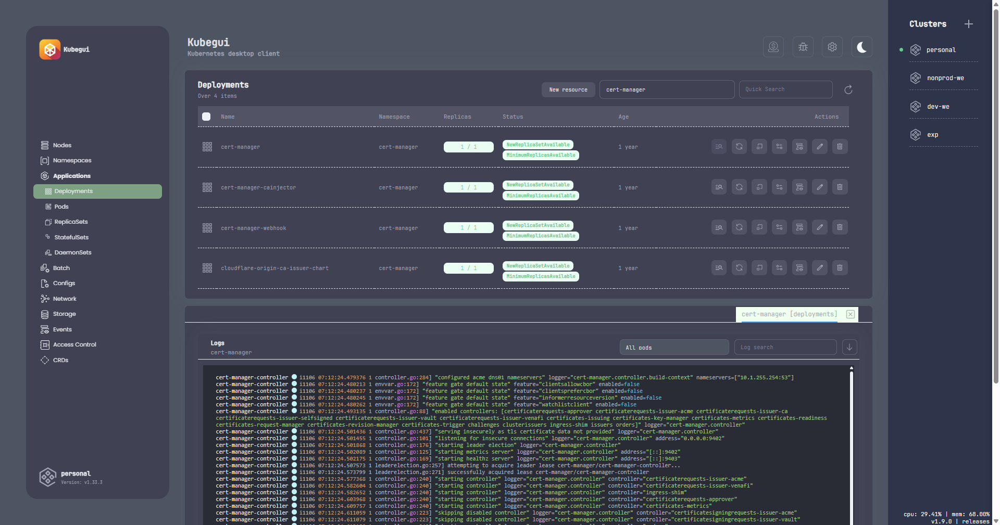

# KubeGUI - Kubernetes UI / admin desktop application
Official website - https://kubegui.net  

  

🚀 **Features**
📋 **Resources list and controls**  
🔄 **Live updates**  
🧩 **CRD support**   
🌐 **Multi-cluster support**  
🤖 **AI suggestions** (optional)  
🧠 **Advanced resource editor** (yaml validation included)  
🕸️ **Network policies visualizer**  
🧱 **Zero external dependencies** (no kubectl needed)  
🛠️ **Deployments and Pods logs** (with syntax highlighter)  
💻 **Direct shell access**  
🔀 **Simple port forwarding**  
⚙️ **Application auto-updater**

## Scope:
- Application releases
- Website src
- Issues/Bugs/Discussions hub

### Roadmap (next v1.9.82 release)
- Init page rework
- Settings modal bugfix
- CRD ui changed/sync fix
- CRD list -> CRD groups links

