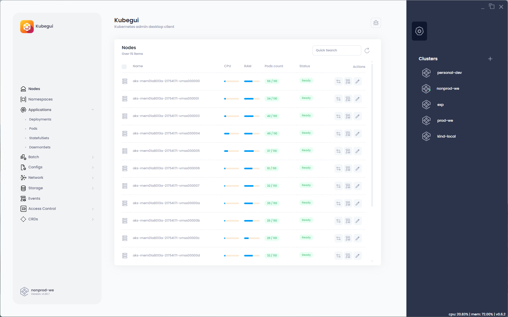

# KubeGUI - Kubernetes UI / admin desktop application

Official website - https://kubegui.io

  

## **Features**       

📋 **Resources list and controls**  
🔄 **Live updates**  
🧩 **CRD support**   
🌐 **Multi-cluster support**  
🤖 **AI suggestions** (optional)  
🧠 **Advanced resource editor** (yaml validation included)  
🕸️ **Network policies visualizer**  
🧱 **Zero external dependencies** (no kubectl needed)  
🛠️ **Deployments and Pods logs** (with syntax highlighter)  
💻 **Direct shell access**  
🔀 **Simple port forwarding**  
⚙️ **Application auto-updater**  

## Roadmap (Q1'2026) -> v1.98.1
- Cilium network policy visualizer
- Node shell exec (via privileged pod with hostNetwork/hostpid)
- Nodes metrics graph perfomance improvements
- Pod removal bugfix
- Can I? (auth check) view for any namespace / core resource
- Connection/config refresh feature (right click -> `refresh` on cluster name in a sidebar); useful for kubelogin/PIM
- File download via `/download %filename%`command inside pod shell
- Workload allocation on nodes graph/visualization (icon inside Nodes view)
- CRDs - All namespaces view fix / Namespace controller fix
- Resource count add/remove bug fix
- Node view fix (fetch speed and metrics allocation)
- Endpoint slices added to a resource viewer
- Resource hierarchy tree (subresourced created by root resource, like deployment->pod) included in details view both for standard resources and CRDs

## Scope:
- Application releases
- Website src
- Issues/Bugs/Discussions hub

